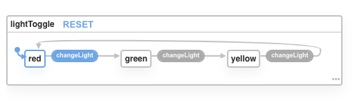

# Traffic Light State Machine

In this exercise you will add a state machine to control a virtual traffic light.  This React Application has a traffic light controlled by a button. 

Your task is to create an XState machine and use it to control how the traffic light appears.

## Learning Goals

In this exercise you will

- Practice implementing a state machine using XState
- Practice using a state machine to control a React Application

## Wave 1 - Implement a State Machine Blueprint Using XState

In this wave go to `src/state-machines/LightMachine.js` and create this state machine in the given `createMachine` function call.

## Wave 2 - Use the State machine

In wave 2 you will then open `src/App.js` and edit the `service.onTransition` callback function.  In this callback function you get the current state that the application is transitioning to and you will then set the `lightStatus` to match the current state.

## Additional Exercises

You do not need to include these in the PR request, unless you want feedback, but we will review these answers in class.

1.  Consider this Finite State Machine 
    1.  Give an example of a valid input to this machine.
    2.  Give an example of an invalid input to this machine (1s and 0s only).
2.  For this FSM, which inputs are valid 
    1.  aaacdb
    2.  ababacdaaac
    3.  abcdb
    4.  acda
    5.  acdbdb
3.  Draw a finite state automata that will accept the word `Banana` whilst using only 3 states.
4.  Draw a finite state machine for the login process we discussed in class.